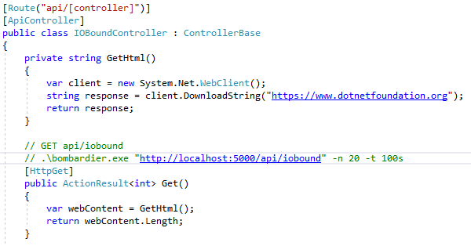
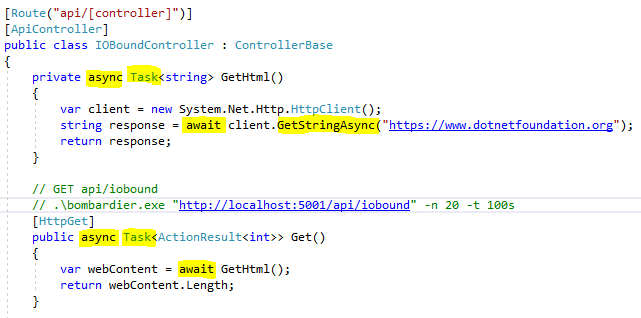
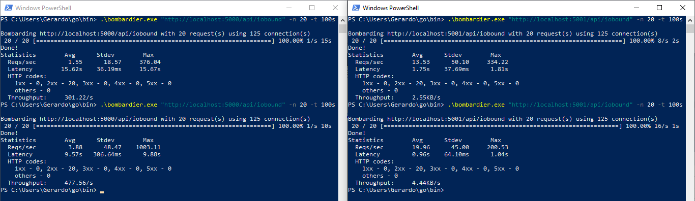

# Scalability and performance in web applications demo
Demo source code of two Web API to demonstrate performance of using async with IO-bound and CPU-bound operations

# Web API running IO-bound operation

## Synchronous code

## Asynchronous code

## Performance compare

